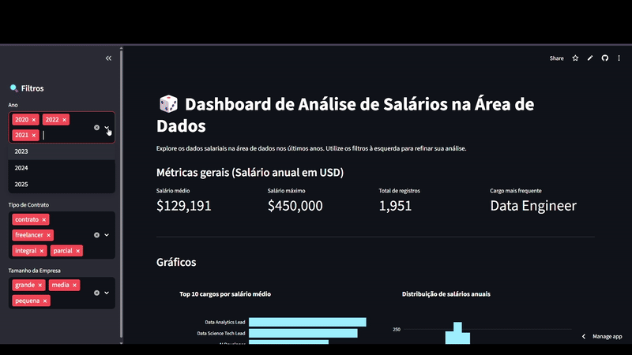

# 📊 Imersão Dados: Dashboard Interativo com Python
Este projeto foi desenvolvido durante a Imersão Dados da Alura, com foco em análise exploratória e visualização de dados utilizando Python. O objetivo principal foi transformar dados brutos em insights visuais através de um dashboard funcional e intuitivo.

  

# 🚀 Funcionalidades
- Análise Exploratória: Tratamento de dados e limpeza com Pandas.

- Visualização Dinâmica: Gráficos interativos que respondem a filtros do usuário.

- Interface Web: Dashboard acessível via navegador para facilitar a tomada de decisão.

- Filtros Customizados: [Ex: Filtrar por data, categoria ou região].

# 🛠️ Tecnologias Utilizadas
- Python: Linguagem base para toda a lógica de dados.

- Pandas: Manipulação e estruturação dos Dataframes.

- Plotly/Matplotlib: Criação dos gráficos estatísticos e interativos.

- Streamlit: Framework utilizado para transformar o script em um app web.
